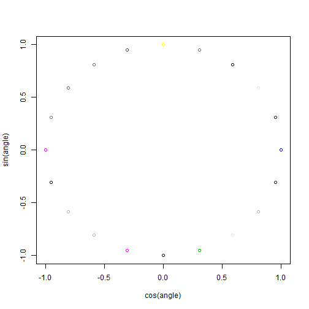

---
title       : peer assessment project
subtitle    : slidify example
author      : yuxiao
job         : student
framework   : io2012      # {io2012, html5slides, shower, dzslides, ...}
highlighter : highlight.js  # {highlight.js, prettify, highlight}
hitheme     : solarized.light     # tomorrow 
widgets     : [bootstrap,quiz]            # {mathjax, quiz, bootstrap}
mode        : selfcontained # {standalone, draft}
knit        : slidify::knit2slides
--- 

## Slide1
plot some funny plots

```r
x<-rbinom(20,prob=0.5,size=40)
angle<-seq(0,2*pi,2*pi/20)
plot(cos(angle),sin(angle),col=x)
```

 

--- .class &radio 

## Slide2

What is 5%2 ?

1. _1_
2. 2
3. 3
4. 4
***.hint 
if 5/2=2*2+1 then 1 = 5%2  
***.explanation 
sdsf

--- .class #id 
## Slide 3


```r
data(diamonds)
summary(diamonds)
```

```
##      carat              cut        color        clarity     
##  Min.   :0.200   Fair     : 1610   D: 6775   SI1    :13065  
##  1st Qu.:0.400   Good     : 4906   E: 9797   VS2    :12258  
##  Median :0.700   Very Good:12082   F: 9542   SI2    : 9194  
##  Mean   :0.798   Premium  :13791   G:11292   VS1    : 8171  
##  3rd Qu.:1.040   Ideal    :21551   H: 8304   VVS2   : 5066  
##  Max.   :5.010                     I: 5422   VVS1   : 3655  
##                                    J: 2808   (Other): 2531  
##      depth          table          price             x        
##  Min.   :43.0   Min.   :43.0   Min.   :  326   Min.   : 0.00  
##  1st Qu.:61.0   1st Qu.:56.0   1st Qu.:  950   1st Qu.: 4.71  
##  Median :61.8   Median :57.0   Median : 2401   Median : 5.70  
##  Mean   :61.8   Mean   :57.5   Mean   : 3933   Mean   : 5.73  
##  3rd Qu.:62.5   3rd Qu.:59.0   3rd Qu.: 5324   3rd Qu.: 6.54  
##  Max.   :79.0   Max.   :95.0   Max.   :18823   Max.   :10.74  
##                                                               
##        y               z        
##  Min.   : 0.00   Min.   : 0.00  
##  1st Qu.: 4.72   1st Qu.: 2.91  
##  Median : 5.71   Median : 3.53  
##  Mean   : 5.73   Mean   : 3.54  
##  3rd Qu.: 6.54   3rd Qu.: 4.04  
##  Max.   :58.90   Max.   :31.80  
## 
```

--- &radio
## Question 1

What is 1 + 1?

1. 1
2. _2_
3. 3
4. 4

*** .hint
This is a hint

*** .explanation
This is an explanation
wait to finish

--- .class #id 
## Slide 5

finally  :)


--- .class #id 


